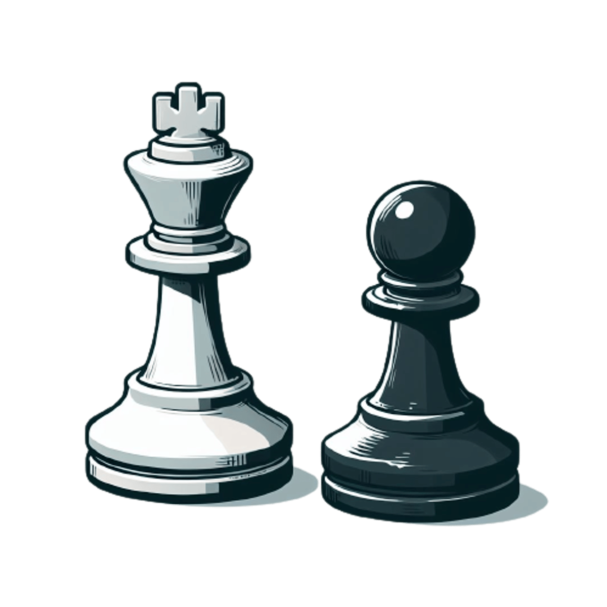

 

  

<h1 align="center">Chess</h1>

  

    Chess game made in Java
     
    

## Sobre o projeto

Comecei o desenvolvimento desde jogo de xadrez quando estava fazendo o curso do professor Nelio
Alves na Udemy. A proposta do curso é desenvolver no aluno uma base sólida em lógica e aplicar o que
se aprendeu sobre Orientação a Objetos.

O jogo de xadrez desenvolvido no curso é muito simples e é executado no terminal da JVM, não possuindo
uma interface gráfica para o usuário. Foi nesse momento que eu pesquisei e descobri o Java Swing.

O Swing é uma biblioteca gráfica para criação de interfaces de usuário para aplicações Java.
O jogo ainda pode receber diversas melhorias, isso vai depender da minha disponibilidade e a medida
que for aprofundando meu conhecimento.

Para me fundamentar na criação do jogo usei como base o livro "Xadrez, o guia definitivo", de James Eade,
o qual foi extremamente útil para que eu não deixasse passar alguns detalhes das regras do jogo.

## Tecnologias usadas

O jogo foi desenvolvido na versão 21.0.3 do Java, usando o Swing para a criação da interface gráfica
e tendo o IntelliJ como IDE.

---

## About the Project
I started developing this chess game while taking Professor Nelio Alves' course on Udemy. 
The course aims to provide students with a solid foundation in logic and apply what they have 
learned about Object-Oriented Programming.

The chess game developed during the course is basic and runs in the JVM terminal, lacking 
a graphical user interface. This prompted me to research and discover Java Swing.

Swing is a graphical library used to create user interfaces for Java applications. The game still 
has room for many improvements, which will depend on my availability and how I progress in deepening
 my knowledge.

To ensure a solid foundation for creating the game, I used the book "Chess for Dummies" by James Eade 
as a reference, which was extremely helpful in ensuring I didn't miss any details of the game's rules.

## Technologies Used

The game was developed using Java version 21.0.3, with Swing for the graphical interface and IntelliJ 
as the IDE.

